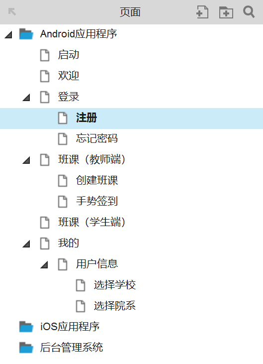

# 3 交互式原型设计

## 3.1 任务描述

使用页面的原型图清晰产品的功能详细需求。

### 3.1.1 任务介绍

- 安装Axure RP软件以及学习Axure RP软件的基本用法。
- 为移动端APP和后台管理系统创建原型。
- 确定项目技术选型。

### 3.1.2 任务要求

使用Axure RP软件为移动端APP和后台管理系统创建原型文件，具体要求如下：

- 创建一个原型文件，在站点地图中分别为移动端APP和后台管理系统创建文件夹。
- 根据移动端APP的产品需求文档中的产品功能结构图对页面进行分类。
- 使用灰模原型设计登录、注册、班课、创建班课，我的，用户信息等功能的页面原型。
- 从原型中导出图片，完善移动端产品需求文档。

## 3.2 工作指导说明

原型设计是帮助我们更细致的思考，并做各项需求的评估，同时也是将自己脑海里的想法进行输出，通过原型设计后，我们就可以进行产品宣讲了。相对于之前抽象的文字描述，原型则更加清晰产品的需求，设计和技术人员或者老板也能够更加直观的了解到产品意图。  
当到了原型设计这一步时，已经不仅仅是构思了，我们需要更加深入的了解每个页面上的元素和这些元素的属性。例如按钮元素，我们就需要考虑这个按钮的功能，并且这个功能操作后带给后端和前端的反馈。举例这个按钮是注册会员按钮，用户操作后，第一步逻辑是验证用户输入的信息是否合法，不合法则给出前端反馈；合法则和后端通信验证是否已经存在同样信息，已经存在则给出前端反馈，不存在则进入下一步，注册成功；注册成功后的反馈是跳转页面，还是弹出层提示用户完善资料，这些都是需要更详情的考虑的。当然这些更细致的思考是留在需求文档撰写时的，而此时我们需要做的就是把这些元素通过原型表现出来。  
原型设计建议使用Axure RP，中文官网建议使用9.0版本。Axure RP可以让负责定
义需求和规格、设计功能和界面的用户能够快速创建应用软件、Web网站以及移动APP的线框图、流
程图、原型和规格说明文档。Axure RP的使用者主要包括商业分析师、信息架构师、可用性专家、产品经理、IT咨询师、用户
体验设计师、交互设计师、界面设计师等，另外，架构师、程序开发工程师也在使用Axure。

### 3.2.1 软件的安装

> [Axure RP 8.1正式版下载地址 安装和汉化说明](https://www.axure.com.cn/3510/)

#### 3.2.1.1 软件的下载

版本 | 下载地址
---|---
Axure RP 9 WIN正式版 | [官网下载](https://axure.cachefly.net/AxureRP-Setup.exe)  [百度云下载](https://note.youdao.com/)
Axure RP 8 | [官网下载](https://axure.cachefly.net/versions/8-0/AxureRP-Setup-3389.exe)  [百度云下载](https://pan.baidu.com/s/1IXd1Pqju6A3K74osKFEBrw) 提取码: u4qd

#### 3.2.1.2 软件汉化

软件的安装比较简单，一路点击“Next”按钮。汉化时首先退出正在运行中的 Axure。一般我们下载到的汉化包都是一个压缩包，解压缩后会有一个名称为“lang”的文件夹，文件夹里面是一个名称为“default”的文件。  
汉化步骤非常简单，只需要把“lang”文件夹放进Axure软件的安装根目录下就可以了。
>[Axure RP 9最新版软件及汉化包下载 正式版](https://www.axure.com.cn/78629/)

### 3.2.1.3 谷歌浏览器插件安装

如果想把原型拿给客户查看，可以生成浏览器格式的产品原型。千万记得给浏览器安装Axure扩展程序哦。  
> [最新Axure谷歌浏览器Chrome扩展程序安装方法](https://www.axure.com.cn/79769/)

开发模式安装

1. 把下载后的.crx扩展名的离线Chrome插件的文件扩展名改成.zip或者.rar，解压压缩文件。
2. 在Chrome的地址栏中输入：chrome://extensions/
3. 打开Chrome浏览器的扩展程序管理界面，并在该界面的右上方的开发者模式按钮上打勾。
4. 在勾选开发者模式选项以后，在该页面就会出现“加载已解压的扩展程序”等按钮，点击“加载已解压的扩展程”按钮，并选择刚刚解压的Chrome插件文件夹的位置，即可安装完成。

### 3.2.1.4 添加元件库

一个页面的内容都是通过一个一个的元件（组件）组成的，所以一般页面所显示的内容我们都能通过元件的组合搭配模拟出来。为了避免重复造轮子（这个轮子我完全造不了），我们可以导入第三方的元件库。

header 1 | header 2 | 下载地址
---|---|---
row 1 col 1 | row 1 col 2 |
row 2 col 1 | row 2 col 2 |

>[FontAwesome v5最新版字体图标元件库分享，一套绝佳的矢量字体图标元件库](https://www.axure.com.cn/78816/)

### 3.2.2 Axure RP 主要功能

#### 3.2.2.1 通过站点地图设置项目结构

在新版的Axure RP软件中站点地图这个名词改叫页面，实际上就是通过一个树的组织结构，为多个页面进行分门别类管理。  
在移动端APP中某个频道下面可能有一个默认页，例如切换到班课频道时，默认显示的是班课列表，因此可以不用文件夹区分频道，直接使用页面表示频道。  
某个功能的实现可能需要多个页面，可以把该功能其他的页面设置成子页面。例如，“我的”频道中用户信息功能需要用到选择学校和院系两个页面，可以把这两个页面做为用户信息的子页面。

#### 3.2.2.2 母版的创建和使用

有一些元件或者元件的集合在多个页面中重复用到，而且这些元件或者元件集合在不同页面中属性的值都设置成一样。为了维护的方便，能够做到一改全改，可以把这个元件或者元件集合创建为母版。然后使用创建好的母版代替页面中相应的元件或者元件集合。例如，移动端APP中的标签栏，就可以创建成母板。

#### 3.2.2.3 元件的属性设置

#### 3.2.2.4 发布与预览

### 3.2.3 原型设计规范

## 3.3 产品要求

无

## 3.4 工作要求

无
