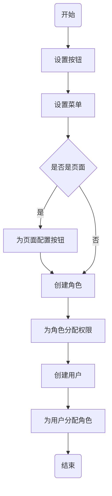
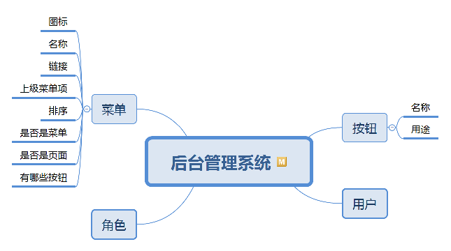
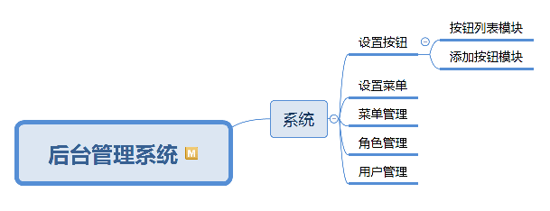

# 4 权限需求分析

## 4.1 任务描述

### 4.1.1 任务介绍

在后台管理系统产品需求文档中编写权限、角色和用户相关功能的详细需求。

### 4.1.2 任务要求

编写后台管理系统产品需求文档，具体要求如下：

- 编写产品需求文档中的用户模块。
- 画出用户、角色和权限相关功能的产品结构图。
- 画出用户、角色和权限相关的信息结构图。
- 编写用户相关功能的详细需求。
- 编写角色相关功能的详细需求。
- 编写权限相关功能的详细需求。

## 4.2 工作指导说明

在后台管理系统中有两类用户：

1. 教师：和移动端应用程序中的教师是同一类角色。
2. 管理员：运营项目的公司内部员工。

在实际项目中，教师不可能操作到后台系统中的各项功能。教师这类用户只是这个项目的实施课堂教学的客户端使用者。像教师、助教和学生这三类用户，是运营这个软件的公司的客户。管理员相当于软件运营商的员工，实际上运营商的员工也会分成不同的角色。

### 4.2.1 权限分配业务流程

权限分配流程图如下：

权限分配说明：

1. 设置按钮：每个功能相关的页面上都有类似的按钮或者超链接，例如，在不同功能的列表页中基本都有删除、修改、打印、导入、导出等链接。根据操作的用途对这些按钮或者链接进行分类，为每一类的按钮或者链接起一个名称或者标记用途。
2. 设置菜单：实际上是配置每个菜单项。大多数的页面是通过点击后台管理系统中的菜单来访问的。通过树这种数据结构来保存菜单项，有些菜单项是作为其他菜单项的父节点，点击这类菜单项时，只会展开或者收缩子菜单项。还有一些页面不是通过菜单项来访问的，即不会出现在菜单中，是通过某个页面上的按钮或者链接来访问。
3. 为角色分配权限：不同的用户可能属于不同的角色，这些角色能访问的页面可能都不一样。这些不同的用户登录后进入后台管理系统时，界面左侧的菜单只显示出有权限访问的菜单项。

### 4.2.2 权限需求分析

在设置角色时需要为某种角色赋予各种权限。权限可以分成4类：

1. 功能权限：不同角色的用户进入系统时看到的菜单是不一样的。有些页面的导航不会出现在菜单项中，通过在浏览器中输入链接，能访问到的页面也存在着不同。例如，经理和业务员登陆系统拥有的功能菜单是不一样的。
2. 按钮权限：不同角色的用户访问某个页面时，页面上的按钮是否可见。例如，经理能够审批，而业务员不可以。
3. 数据权限：不同部门的用户能够浏览的数据也不同，数据需要过滤。例如，A业务员看不到B业务员的单据。
4. 字段权限：页面中某个字段是否可见。例如，某些人查询客户信息时看不到客户的手机号或其它字段。

这次项目至少实现功能权限，有能力的小组可以增加实现按钮权限。  

### 4.2.2.1 权限有关的信息结构图

### 4.2.2.2 权限有关的产品功能结构图

"系统"是频道，相当于是第一级的菜单项。某某管理是功能页面，相当于某功能的列表页。"设置按钮"没有单独的添加页面，而是把添加作为列表页中的子模块，主要是因为添加按钮需要输入的信息较少。“设置菜单”相当于添加菜单项，这个功能页面比较复杂，所以独立一个页面。这个页面中需要一个树模块，展示各菜单项之间的关系，还需要一个输入模块，用于输入菜单项信息。  
使用Axure设计原型时，要注意，“系统”没有对应的页面，应该使用一个文件夹表示，

### 4.2.3 角色需求分析

为了对许多拥有相似权限的用户进行分类管理，定义了角色的概念。

### 4.2.4 用户需求分析

应用系统的具体操作者，用户是不能直接分配权限的，必须要分配一个角色，角色中再分配权限。

## 4.3 产品要求

无

## 4.4 工作要求

无
