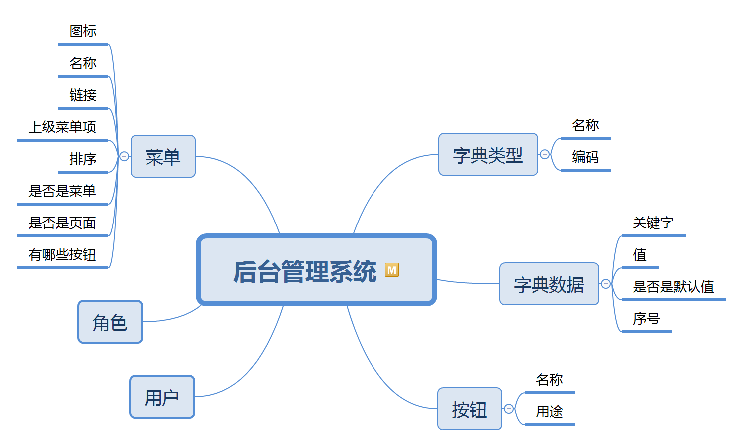

# 5 数据字典需求分析

## 5.1 任务描述

### 5.1.1 任务介绍

在后台管理系统产品需求文档中编写数据字典相关功能的详细需求。

### 5.1.2 任务要求

编写后台管理系统需求文档具体要求如下：

- 画出数据字典相关功能的产品结构图。
- 画出数据字典的信息结构图。
- 编写数据字典相关功能的详细需求。

## 5.2 工作指导说明

在应用程序中，有一种实体的属性，它的值可以在多个数据之间选择。例如，员工的学历属性，学历它的取值范围可以是高中、大专、本科、研究生等。在页面中基本上使用下拉列表，输入时让用户选择。最简单的实现方式是把这些数据直接写在页面中，如果学历在其他功能中还会被使用到。例如，员工查询中使用学历作为查询的条件，那就把之前页面的代码复制粘贴。但是，这样的处理方式维护性实在是差，把研究生改成硕士和博士，又或者大专和本科说法不够专业，用户要改成大学本科，大学专科，这种情况下多个功能使用到，无法做不到一改全改。  
在数据库中添加相关的表可以解决上面的痛点，增加学历表，与员工表外键关联。如果需要修改名称或者增加某个值，直接改数据库就可以了。在应用程序中，这类的属性是很多的，因此需要增加无数的表。修改数据时不可能让用户直接操作数据库，普通用户也没有这个能力。还要为这些表开发增删改查的功能，大量重复的代码。  
为了解决上面开发中存在的各种问题，我们可以考虑把这类属性的所有可选择的数据存放在同一张数据库的表中。给用户提供一个页面可以添加、修改和删除这些数据，

### 5.2.1 数据字典信息结构图

这里使用信息结构图实际上不合适，这种功能和客户没有什么太大关系。最主要是为了后期的开发或者维护方便，程序员自己折腾出来的。所以用实体关系图更合适些，但现在还是先借用思维导图来画。后面的任务设计到数据库建模时，再介绍相关的知识。  

**字典类型**  
名称：类型名称，用中文体现出这种类型的用途。例如：学历、每页记录数、性别等。  
编码：唯一标记，用于找到属于该类型所有数据。前端需要使用到这组数据时，把编码传给服务器端。  
**字典数据**  
关键字：key，类似`<select>`的子元素`<option>`的`value`属性。  
值：给用户看的数据，类似`<option></option>`之间的文本  
序号：下拉列表中出现的位置  
是否默认值：下拉列表的默认值

### 5.2.2 调整产品结构图

### 5.2.3 原型设计

## 5.3 产品要求

无

## 5.4 工作要求

无
