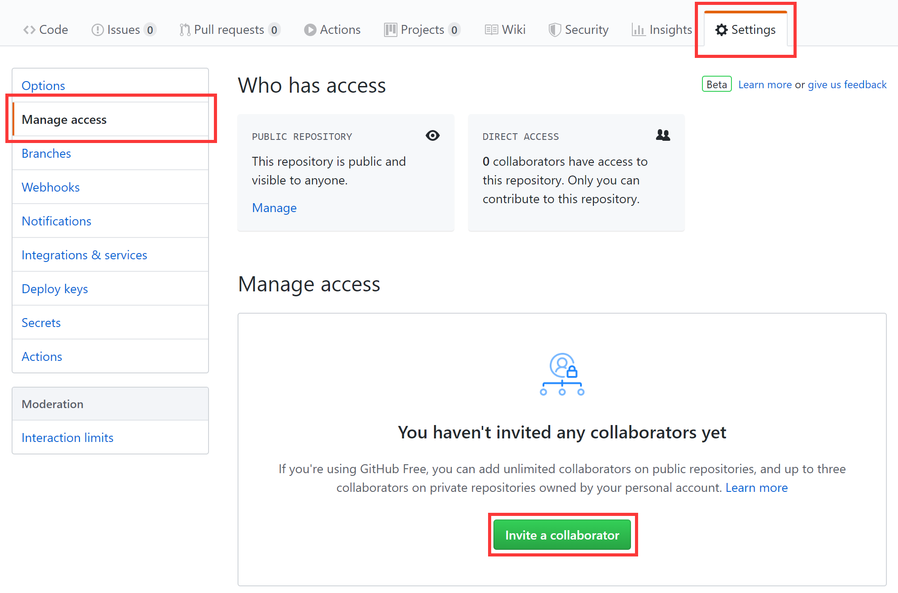

# 7 源代码版本管理

## 7.1 任务描述

### 7.1.1 任务介绍

使用git控制源代码版本。继续编写移动端应用程序和后台管理系统的产品需求文档。

### 7.1.2 任务要求

- 使用Git控制源代码版本
  - 注册Github账户
  - 安装Github Windows桌面版
  - 创建4个本地仓库，分别用于管理手机端应用程序、Web前端应用程序、后台应用程序以及相关文档。也可以只创建一个仓库，再使用文件夹分门别类管理。
  - 把仓库发布到Github网站，并记录相关仓库的链接
  - 为仓库添加协作者
  - 其他成员clone相关仓库
- 继续编写移动端应用程产品需求文档
  - 教师查看班课的成员：经验值排名、头像、姓名、学号、经验值。可以更具经验值或者学号降序排列。
  - 教师查看成员的详细信息：学生的基本信息、签到统计信息：签到的总经验值、实际签到经验值、出勤等级。查看成员获得经验值的明细。
- 积雪编写后台管理系统产品需求文档
  - 教师和系统管理员设置学校、学院、系或者专业
  - 系统管理员设置日常学习行为以及默认获得的经验值。例如：考勤签到，默认2经验值。
  - 系统管理员配置出勤的等级及对应的出勤率。

## 7.2 工作指导说明

[学习Pro Git](https://www.progit.cn/)  
访问GitHub网站，[点我](https://github.com)，注册一个账号。

### 7.2.1 创建仓库

#### 7.2.1.1 在线创建仓库

#### 7.2.1.2 使用图形界面创建仓库

#### 7.2.1.3 邀请协作者

### 7.2.2 GitHub图形界面的使用

每次开发之前，先pull，从GitHub上的仓库中拉取最新版本的代码。然后再进行开发。  
开发完毕后，在把代码同步到GitHub上的仓库时，再一次先使用pull将代码同步到与GitHub上的仓库一致。  
最后再使用push提交自己的更新。

#### 7.2.2.1 Commit

#### 7.2.2.2 我要吃后悔药

#### 7.2.2.3 冲突

## 7.3 产品要求

无

## 7.4 工作要求

无
