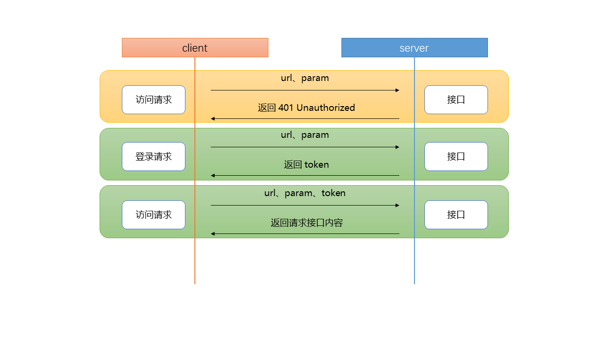

# 16 Token

## 16.1 任务描述

### 16.1.1 任务介绍

使用token验证用户身份。

### 16.1.2 任务要求

- 解决跨域问题。
- token创建、校验、刷新的实现。

## 16.2 工作指导说明

### 16.2.1 跨域

>[正确面对跨域，别慌](https://juejin.im/post/5a2f92c65188253e2470f16d)  

什么是跨域？  
跨域，是指浏览器不能执行其他网站的脚本。它是由浏览器的同源策略造成的，是浏览器对JavaScript实施的安全限制。
同源策略限制了一下行为：

- Cookie、LocalStorage 和 IndexDB 无法读取
- DOM 和 JS 对象无法获取
- Ajax请求发送不出去

所谓的同源是指，域名、协议、端口均为相同。

```xml
<customHeaders>
  <add name="Access-Control-Allow-Origin" value="*" />
  <add name="Access-Control-Allow-Headers" value="*" />
  <add name="Access-Control-Allow-Methods" value="GET, POST, PUT, DELETE" />
</customHeaders>
```

以上是Asp.net中的web.config文件的配置

### 16.2.2 Cookie和Session

HTTP无状态

#### 16.2.2.1 Cookie

cookie的内容主要包括：名字，值，过期时间，路径和域。路径与域一起构成cookie的作用范围。cookie数据存放在客户的浏览器上。

#### 16.2.2.2 Session

session会在一定时间内保存在服务器上，默认20分钟。客户端浏览器访问服务器时，服务器会分配一个session id。服务器使用cookie把session id保存在客户端。客户端每次请求时，通过cookie把session id提交给服务器。

### 16.2.3 JWT介绍

JWT: JSON Web Token  
JWT的原则是在服务器身份验证之后，将生成一个JSON对象（用户相关数据，用户名，角色等，但不能带私密的数据，例如密码）并将其发送回客户端。  
JWT头部

```ts
{

"alg": "HS256",

"typ": "JWT"

}
```

有效载荷  
是JWT的主体内容部分，也是一个JSON对象，包含需要传递的数据。 JWT指定七个默认字段供选择。

iss：发行人

exp：到期时间

sub：主题

aud：用户

nbf：在此之前不可用

iat：发布时间

jti：JWT ID用于标识该JWT

除以上默认字段外，我们还可以自定义私有字段

签名哈希  
签名哈希是对上面两部分数据签名，通过指定的算法生成哈希，以确保数据不会被篡改。  
首先，需要指定一个密码（secret）。该密码仅仅为保存在服务器中，并且不能向用户公开。然后，使用标头中指定的签名算法（默认情况下为HMAC SHA256）生成签名。在计算出签名哈希后，JWT头，有效载荷和签名哈希的三个部分组合成一个字符串，每个部分用"."分隔，就构成整个JWT对象。

### 16.2.4 token创建、校验、刷新的实现



服务器端：登录账号和登录密码验证成功后，创建token返回给客户端。  
客户端：接收都token后，把token保存在localstorage中。每次与服务器交互时，将token放入HTTP请求的Header Authorization字段中。
服务器端：验证token是否过期，签名是否正确。

```c#
public interface ITokenAppService
{
    JwtTokenDto Create(UserDto dto);

    JwtTokenDto Refresh(string token, UserDto dto);

    bool IsActive(string token);

}
```

```xml
"Jwt": {
    "Issuer": "www.czb.com",
    "Audience": "www.czb.com",
    "SecurityKey": "你的密钥",
    "ExpireMinutes": "20"
}
```

## 16.3 产品要求

无

## 16.4 工作要求

无
